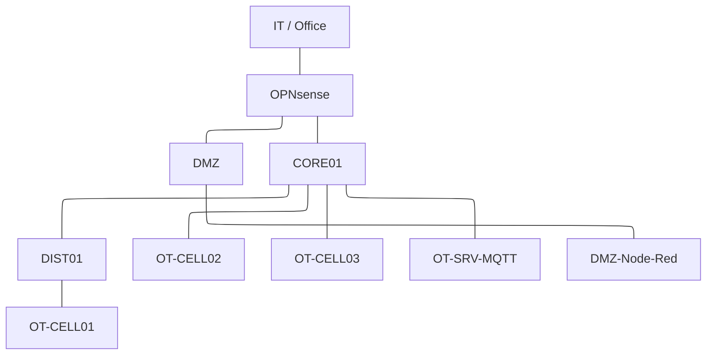

# OT Security Lab

A home-built OT/ICS cybersecurity laboratory designed to explore industrial network architecture, IT/OT segmentation, monitoring, detection and security operations in a controlled environment.

The lab is built with [GNS3](https://www.gns3.com/) and currently runs on a small physical lab host. It simulates an environment combining enterprise IT, DMZ and multiple industrial OT cells with firewalls, routing, VLAN segmentation, industrial communication and simulated PLC systems.

The main goal of the project is to build a practical environment for learning and experimenting with **OT/ICS network security and cybersecurity operations**.

---

## Lab Architecture




The environment is designed around a simplified separation between enterprise IT and industrial OT networks.

The current architecture includes:

- IT / Office network
- DMZ
- OPNsense firewall
- MikroTik CHR as core router
- Multiple OT cells
- MQTT broker
- Node-RED
- Simulated PLCs using Python script
- VLAN-based segmentation
- Inter-zone routing

The architecture will evolve as additional monitoring and security components are introduced.

---

## Project Goals

The laboratory is intended to provide a practical environment for learning:

- OT/ICS network architecture
- IT/OT segmentation
- VLANs and inter-zone routing
- Firewall policy design
- Industrial network communication
- MQTT-based communication
- Network monitoring
- IDS and network security monitoring
- Centralized logging
- Incident detection and investigation
- OT cybersecurity concepts
- SOC and SIEM concepts
- Secure administration of industrial environments

The focus is on understanding **how the different components interact**, how trust boundaries are designed, and how security controls can be introduced without losing sight of the operational requirements of an industrial environment.

---

## Network Zones

The laboratory is divided into several logical security zones.

| Zone | Purpose |
|---|---|
| IT / Office | Simulated enterprise users and services |
| DMZ | Controlled communication between IT and OT environments |
| OT Core | Routing and connectivity between industrial segments |
| OT-CELL01 | First simulated industrial cell |
| OT-CELL02 | Second simulated industrial cell |
| OT-CELL03 | Third simulated industrial cell |

Additional dedicated infrastructure and security zones may be introduced as the laboratory develops.

---

## Current Components

### Network & Security

- **OPNsense** — firewall and network security gateway
- **MikroTik CHR** — routing and core network functions
- **Open vSwitch (OVS)** — virtual switching and VLAN segmentation
- **GNS3** — network and infrastructure simulation

### OT / Industrial Environment

- Simulated PLCs
- MQTT broker

### Virtualization

The current laboratory runs on a small physical host:

- Intel Core i5-8500
- 16 GB RAM
- Windows 11 Pro
- Ubuntu VM — 2 GB RAM
- GNS3 VM — 6 GB RAM

The laboratory runs on limited hardware resources, which makes resource efficiency an important part of the project. The goal is to build a useful OT security environment without requiring enterprise-grade hardware.

Not everything can be realistically run on the current hardware, especially when multiple security and infrastructure services are involved. The laboratory is therefore expanded gradually, prioritizing components that provide the most practical learning value within the available resources.


---

## Planned Components

The following components are planned for future stages of the laboratory:

- IDS using Zeek and/or Suricata
- Infrastructure services
  - NTP
  - Syslog
- Dedicated Engineering Station inside the OT environment
- Jump Server
- Additional monitoring and logging
- Security event collection
- Detection and investigation workflows
- Additional OT/ICS security scenarios

A second physical computer may eventually be used as a dedicated security monitoring/SOC host, potentially running a SIEM such as Wazuh.

---

## Cybersecurity Scenarios

As the laboratory develops, it will be used to create controlled cybersecurity scenarios involving both IT and OT environments.

Potential scenarios include:

- Unauthorized communication between network zones
- Misconfigured firewall rules
- Suspicious network traffic
- Unauthorized access to OT systems
- Compromised engineering workstation
- Abnormal PLC communication
- Unexpected MQTT activity
- Lateral movement between network segments
- Network reconnaissance
- Detection and investigation using IDS and centralized logging

The intention is not only to generate traffic or attacks, but to understand the complete process:

**Architecture → Communication → Detection → Investigation → Response**

All testing is performed within the isolated laboratory environment.

---

## Technologies

The project currently involves or plans to involve:

- GNS3
- OPNsense
- MikroTik RouterOS / CHR
- Linux
- Windows
- VLANs
- TCP/IP networking
- MQTT
- OPC UA
- Modbus TCP
- BACnet/IP
- EtherNet/IP
- Node-RED
- Python
- Zeek
- Suricata
- Syslog
- NTP
- Wazuh / SIEM
- VPN tunneling

---

## Repository Structure

The repository contains configuration files, scripts, documentation and other project resources used to build and operate the laboratory.

The structure will evolve together with the project.

```text
.
├── configs/
│   └── ...
├── diagrams/
│   └── ...
├── docs/
│   └── ...
├── gns3/
│   └── ...
├── node-red/
│   └── ...
├── python_plc_sim/
│   └── ...
├── wireshark/
│   └── ...
├── ...
└── README.md

```

Generated files, packet captures, credentials and other sensitive or unnecessary artifacts are intentionally excluded from version control.

---

## Project Status

**Status: Active / Work in Progress**

The core laboratory environment is operational and the project is being developed incrementally.

### Current Focus

- Expanding the OT architecture
- Improving network segmentation
- Adding infrastructure services
- Introducing network monitoring
- Building security detection scenarios
- Documenting the environment

The project is intentionally developed in stages rather than attempting to build a complete SOC/OT security platform from the beginning.

---

## Roadmap

- [x] Initial GNS3 environment
- [x] IT / DMZ / OT architecture
- [x] OPNsense firewall
- [x] MikroTik CHR routing
- [x] VLAN segmentation
- [x] Multiple OT cells
- [x] MQTT / Node-RED environment
- [x] PLC / HMI / robot simulation
- [ ] Engineering Station
- [ ] Jump Server
- [ ] NTP infrastructure
- [ ] Centralized Syslog
- [ ] Zeek / Suricata IDS
- [ ] Security monitoring
- [ ] Detection scenarios
- [ ] Incident investigation workflows
- [ ] Dedicated SOC / SIEM host
- [ ] Wazuh integration
- [ ] Expanded OT/ICS attack and detection scenarios
- [ ] VPN tunneling
- [ ] Modbus TCP simulator
- [ ] OPC UA simulator
- [ ] Additional OT/ICS protocol simulators
  - [ ] S7comm
  - [ ] DNP3
  - [ ] BACnet/IP
  - [ ] EtherNet/IP

---

## Learning Philosophy

This project is primarily a **learning and experimentation environment**.

Rather than focusing only on individual security tools, the laboratory is built around understanding the relationship between:

- Network architecture
- Industrial processes
- Communication flows
- Segmentation
- Security controls
- Monitoring
- Detection
- Incident response

The intention is to gradually move from **building the network** to **understanding and defending the network**.

---

## Disclaimer

This laboratory is intended for educational purposes, experimentation and cybersecurity training.

All security testing and simulated attack scenarios are performed within an isolated laboratory environment. No testing is intended against production industrial systems or networks without explicit authorization.